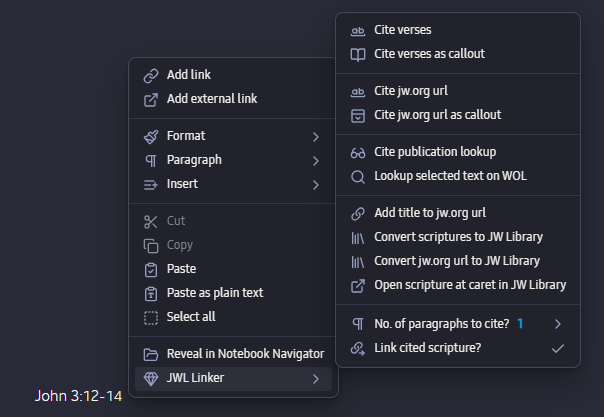

# JWL Linker Plugin for [Obsidian](https://obsidian.md)

Display all scripture references as *JW Library* links In Reading View. Adds commands to convert scriptures references and JW.Org links to *JW Library* links. Adds commands to fetch verse, paragraph, and publication citations.

# How to Install

Download the [latest version](https://github.com/MrBertie/jwl-linker/archive/refs/heads/main.zip) from this link, and unzip it.  
You see a folder called `jwl-linker-main`; rename this folder as `jwl-linker` and then add it into your `{Obsidian Vault}/.obsidian/plugins` folder.  
Restart Obsidian and go to the *Community Plugins Settings* page to enable the plugin.

*Note: you can also click the `<>Code` button above and choose `Download.zip`*

# How to Use In Reading View

Displays all valid scripture references as *JW Library* links.
Open any page that contains scripture references, e.g. `Rom 1:20; Psalm 89:18; 1 Cor 9:26, etc...` and then simply switch to *Reading View.*  

You should see that all scripture references are now displayed as functioning hyperlinks; in addition any abbreviated bible book names will be written out in full.  Invalid scripture references will be ignored.

> Note: This only affects the *Reading View*, it does not modify the underlying Markdown text.

# How to Use In Editing View

The plugin provides many new commands to work with scriptures, publication references and JW.Org links.

To access the commands:
- On Desktop: right-click next to the scripture, and hover on *JWL Linker* to see the list of commands.

  
- On Mobile: add a toolbar item for the *JWL Linker* command.

| Command                               | Mode | Target                          | Result                                                                                  | Replace target | 
| -------------------------------------| ---- | ------------------------------ | ------------------------------------------------------------------------------------ | ------------- |
| Cite verses                           | Edit | Scripture reference             | `[[ JW Library url \| scripture reference ]] < Verses in plain format >`                | Adds below     | 
| Cite verses as callout                | Edit | Scripture reference             | `[[ JW Library url \| scripture reference ]] < Verses in callout format >`          | Adds below     | 
| Cite jw.org url                       | Edit | wol.jw.org \| jw.org/finder url | `[[ original url \| article nav title ]] < Full citation in plain format >`         | Adds below     | 
| Cite jw.org url as callout            | Edit | wol.jw.org \| jw.org/finder url | `[[ original url \| article nav title ]] < Full citation in callout format >`       | Adds below     | 
| Cite publication lookup               | Edit | Publication reference           | `[[ JW Library url \| publication reference ]] < Full citation of lookup article >` | Adds below     | 
| Lookup selected text on WOL           | Edit | All text \| pub. reference       | `Open WOL lookup using selected as search text`                                         | Opens          | 
| Add title to jw.org url               | Edit | wol.jw.org \| jw.org/finder url | `[[ original url \| article nav title ]]`                                               | Replaces       | 
| Convert scriptures to JW Library      | Edit | Scripture reference             | `[[ JW Library url \| scripture reference ]]`                                           | Replaces       | 
| Convert jw.org url to JW Library      | Edit | wol.jw.org \| jw.org/finder url | `JW Library url (Converts just the url portion)`                                    | Replaces       | 
| Open scripture at caret in JW Library | Edit | Scripture reference             | `Open JW Library at the scripture`                                                      | Opens          | 
| (Link scriptures as JW Library)       | HTML | Scripture reference             | `<a href …> scripture reference </a>`                                                   | Replaces       | 

# Details on the usage

### Cite verses

This command fetches bible verse content online and inserts (or cites) the text directly into the page markdown content with plain formatting.  Any range of verses with in a single chapter is accepted, e.g. `Ac 12:1-4.`
Click anywhere in the scripture reference, then click the run the command.  The plugin will show a popup notice while it is fetching the citation, and then insert it together with the scripture.

## Cite verses as callout

As above but uses callout formatting.

----

## Cite jw.org url as callout 

This command fetches the paragraph content from an existing jw.org link and inserts it with plain formatting, together with the correct navigation title.

Note: to create this kind of link in wol.jw.org first click on a paragraph (you will see faint underlining), then copy the page link.

## Cite jw.org url as callout

As above, but uses callout formatting.

----

## Cite publication lookup

This command fetches the result of a standard WT publication reference, and inserts the resulting article below the original reference on the page.
Select the publication reference including the pages and run the command.

## Lookup selected text on WOL

Open WOL website and search based on the selected text. Works well for publication references also.

----

## Add title to jw.org url 

Adds the correct navigation title to an existing wol.jw.org link.

## Convert scripture to JW Library 

This command converts Bible scripture references to *JW Library* links.
Click anywhere in a line or select text that contains scripture references then click the command and the scriptures should be converted to a local JW Library links.

> Note: Unlike the 'Reading View' option above this command permanently rewrites scripture references as a markdown style link in the Markdown text.  The Reading View option is non-destructive.

## Convert jw.org url to JW Library

Converts existing wol.jw.org and jw.org Finder style links [^1] into local JW Library links.

## Open scripture at caret in JW Library

Open the scripture under the caret in the local JW Library app.

----

# Opening links

Click on a newly created link to open it directly in your installed *JW Library* app at that scripture or publication reference.

# Plugin Settings

The various templates and other parameters can be changed in the plugin settings.

# Tips for using Commands

You can also:
  1. Use a plugin like *Commander* to add a new command wherever you prefer
  2. Use the *Command palette* `Ctrl + P` to call up the commands as needed; just start typing "jw..." and they should be listed  
  3. You can also used *Pinned commands* in the *Command Palette* to keep them available at the top (works well on mobile)

[^1]: The type of link you get when you click on the 'Share Link' option on JW.Org, WOL.Org, or in the *JW Library* App.

